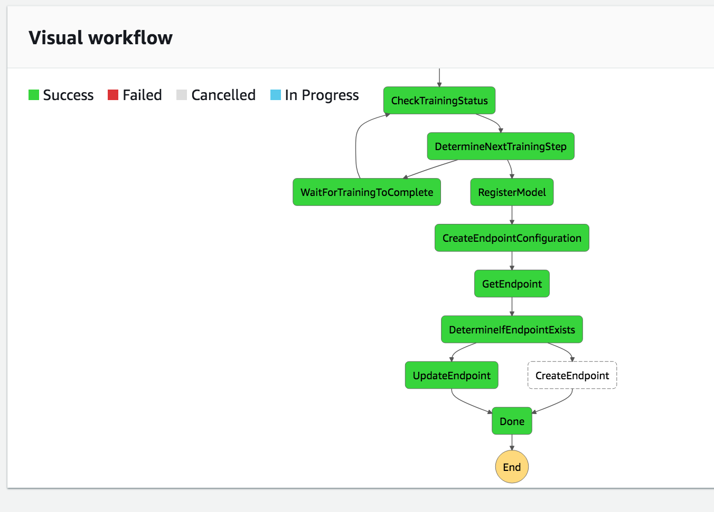
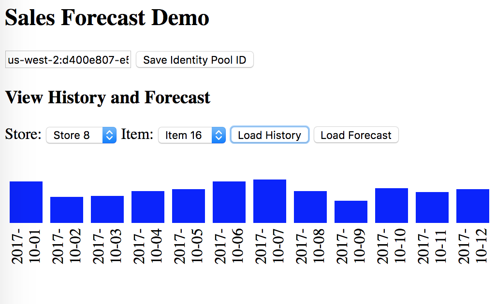
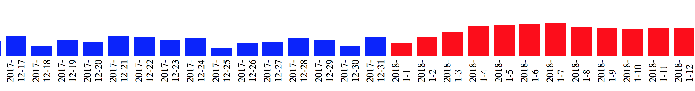
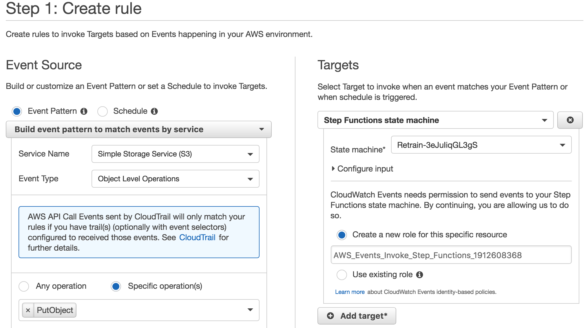
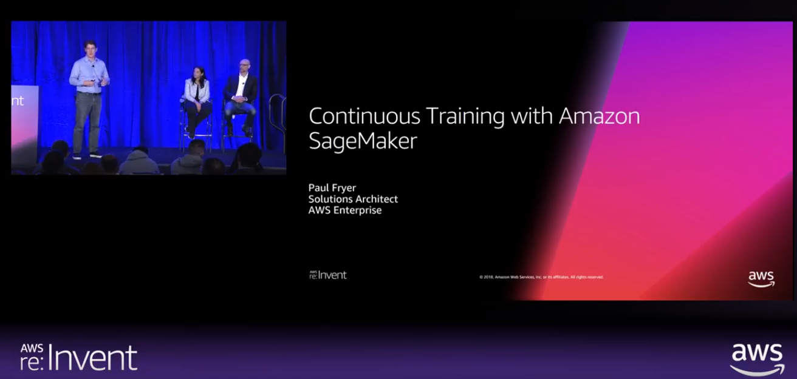

## Amazon SageMaker DeepAR Retail Sample

Reference project for building a DeepAR forecasting model to predict store sales. This will build a Step Function that will launch a training job on SageMaker then update a prediction endpoint which can be used to forecast future store sales.

After you the model has been built and deployed you can test it with a UI tool included in this project.

History (blue color) is loaded from S3

Forecasts (red color) are loaded from SageMaker endpoint

## License

This library is licensed under the Apache 2.0 License. 

## Installation Instructions

Note: Supported regions are Oregon, Virginia, Dublin.

1. Download this CloudFormation template: https://raw.githubusercontent.com/aws-samples/amazon-sagemaker-deepar-retail/master/initialization-template.json
2. Execute the CloudFormation template, provide a Stack Name of **retail-deepar** - be sure to use lowercase letters.

Once the CloudFormation template has finished it will kick off a CodeBuild project that will clone this repository into a private CodeCommit repository in your account. A CodePipeline was also created which will be triggered when the clone happens. This will build the source code and deploy it with 2 more CloudFormation templates:

1. **retail-deepar-deployment** - this includes all the code that was built, i.e. Lambdas and Step Functions.
2. **retail-deepar-base** - this includes the base resources for the project.

## Building the Retail DeepAR Model

After all 3 CloudFormation templates have run you can kick off the Step Function named **Retrain**. This will look for a file named **SageMaker/train.csv** inside the bucket that was created from the **retail-deepar-base** CloudFormation template. Besure to place that file at that location in that folder. You can download that file here: https://raw.githubusercontent.com/aws-samples/amazon-sagemaker-deepar-retail/master/train.csv

## Testing the Model

After the **Retrain** Step Function has completed you can test the forecast model you built with this test tool:
https://raw.githubusercontent.com/aws-samples/amazon-sagemaker-deepar-retail/master/public/index.html

1. Download that file to your desktop, then open it in **Chrome** browser. (only Chrome is tested, so use that). 
2. Set the **UserPoolId**. You can find that in the **Resources** tab of the **retail-deepar-base** CloudFormation template in the AWS console.
3. Pick a store and item then load the last 90 days of data by clicking the **Load History** button.
4. Click the **Load Forecast** button to load the forecast for the next 90 days. It will be appended to the end of the table so you scrole to the right to view.

## Enabling Continuous Training

If you want to retrain on data as it's dropped into S3, you can build a trigger that kicks off the **Retrain** Step Function every time new data is placed in S3.

## Walkthorugh of code from re:Invnet 2018

[[]
(https://www.youtube.com/watch?v=0B9H9weE3FM&t=36m46s)
